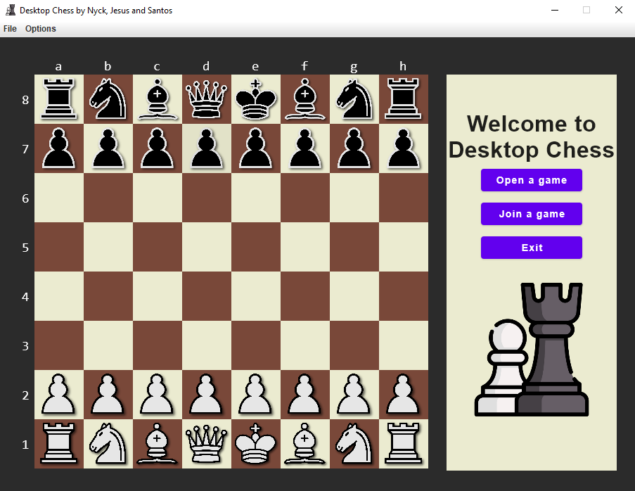

# Desktop Chess ♟

> Desktop chess, is, as the name implies, a desktop chess application, build in Kotlin 
> using [Compose for Desktop](https://www.jetbrains.com/lp/compose-mpp/).

  

---

# Description

Desktop Chess allows the user to play chess in the following modes:
- Single-player: where you can challenge yourself, learn new moves or play with someone else on the same computer
- 1v1: where you can play with your friends and see which one of you is the Chess Master!

---

# Project Structure

The project is organized in 4 packages:
- domain: implements the application behavior/logic
- storage: implements the application storage, in memory or using a MongoDB database
- ui:
  - console: implements the console application methods
  - compose: implements the application ui, using Compose for Desktop
- play_games_from_chess_com: where It's possible to play games from the Chess.com API

There's also the test directory, composed of more than 400 unit tests, 
to make sure that the code is all working correctly👌.

---

# Authors

- [André Jesus](https://github.com/Andre-J3sus)
- [Nyckollas Brandão](https://github.com/Nyckoka)
- [André Santos](https://github.com/AndreSantos0)

**Professor:** Eng. Paulo Pereira

@ISEL 
Bachelor in Computer Science and Computer Engineering 
Software Development Techniques - LEIC32D - Group 03 
Winter Semester of 2021/2022